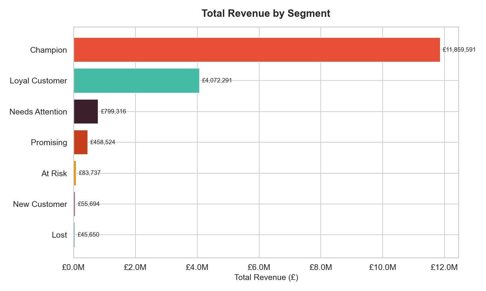
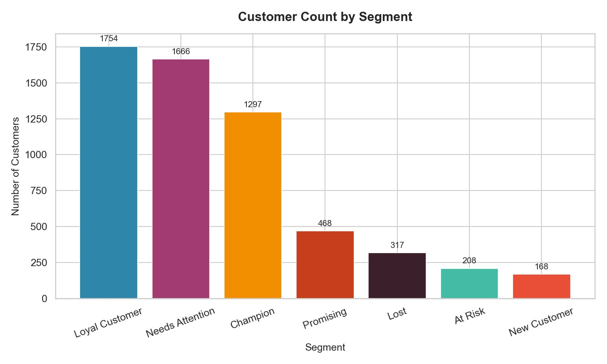
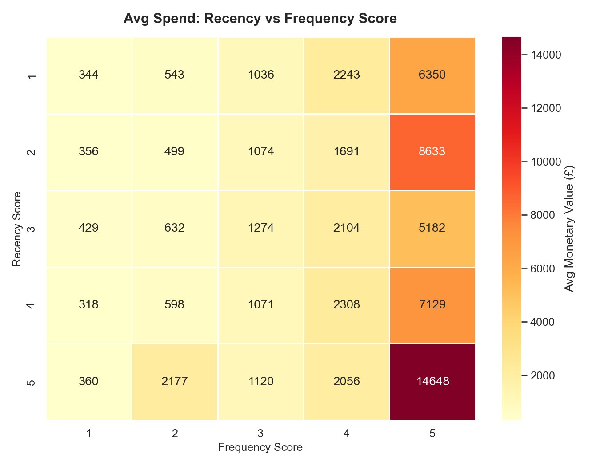
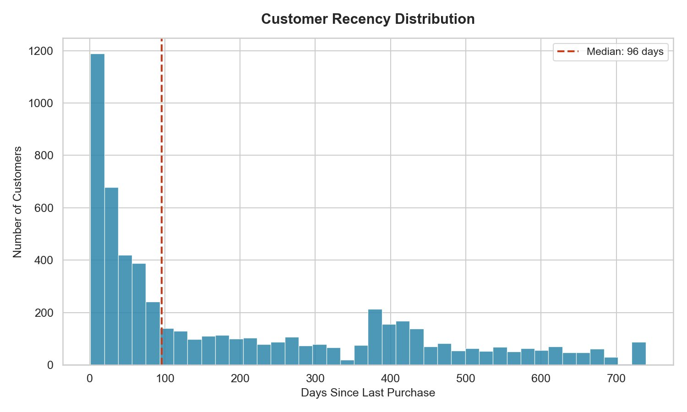
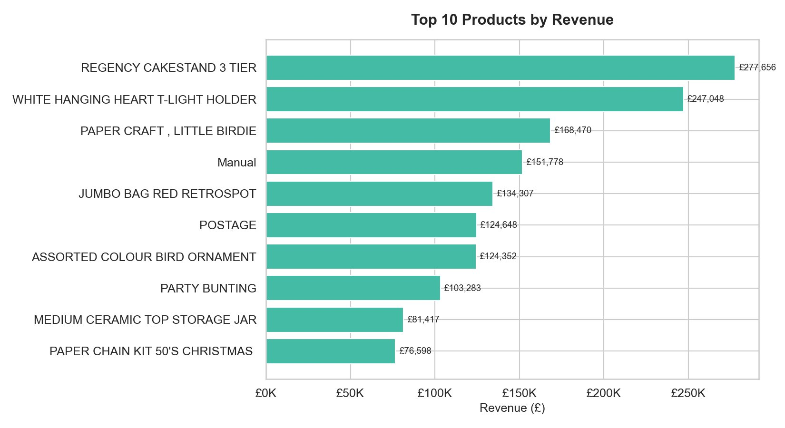

# 🛒 E-Commerce Customer Segmentation using RFM Analysis



## 📌 Project Overview

An **end-to-end data analytics project** that segments **5,878 customers** from a UK-based online retailer using **RFM (Recency, Frequency, Monetary) Analysis** on over **1 million real transactions** spanning 2009–2011.

Built using **SQL → Python → Power BI** pipeline, this project identifies 7 actionable customer segments — from high-value Champions generating £11.8M revenue to At-Risk customers with £83K recoverable revenue.

> 🏆 **Resume bullet:** *"Built end-to-end RFM segmentation pipeline on 779K+ e-commerce transactions using SQL, Python & Power BI — identified 1,297 Champion customers generating £11.8M (70% of total revenue) and flagged 208 At-Risk customers for targeted retention."*

---

## 🎯 Business Problem

> *"Which customers are most valuable, which are slipping away, and which need re-engagement?"*

A UK e-commerce retailer with 1M+ transactions had no systematic way to understand customer behavior. This project builds a **data-driven segmentation pipeline** to answer that question and quantify revenue at risk.

---

## 📊 Key Results

| Segment | Customers | Total Revenue | Avg Spend | Avg Recency |
|---|---|---|---|---|
| 🏆 Champion | 1,297 | **£11,859,591** | £9,143 | 20 days |
| 💙 Loyal Customer | 1,754 | £4,072,291 | £2,321 | 174 days |
| ⚠️ Needs Attention | 1,666 | £799,316 | £479 | 333 days |
| 🌱 Promising | 468 | £458,524 | £979 | 61 days |
| 🔴 At Risk | 208 | £83,737 | £402 | 398 days |
| 👋 New Customer | 168 | £55,694 | £331 | 30 days |
| 💀 Lost | 317 | £45,650 | £144 | 574 days |

**Top Insights:**
- Champions = 22% of customers → **70% of revenue (£11.8M)**
- Median customer recency = **96 days** (healthy retention)
- Revenue peak: **November 2010 (£1.17M)** and **November 2011 (£1.16M)** — Christmas gifting season
- Top product: **REGENCY CAKESTAND 3 TIER** — £277,656 revenue

---

## 🛠️ Tech Stack

| Tool | Purpose |
|---|---|
| **MySQL 8.0** | Data storage, cleaning, and SQL analysis |
| **Python 3.11** | RFM scoring and customer segmentation |
| **Pandas 3.0** | Data manipulation and aggregation |
| **Matplotlib / Seaborn** | 6 publication-ready charts |
| **Power BI Desktop** | Interactive dashboard |
| **SQLAlchemy** | Python-MySQL connection |

---

## 📁 Project Structure

```
ecommerce-rfm-customer-segmentation/
│
├── 📂 sql/
│   └── week1_queries.sql         # Data cleaning + 5 business insight queries
│
├── 📂 python/
│   ├── rfm_analysis.py           # RFM scoring pipeline (Week 2)
│   └── visualizations.py         # 6 chart generation scripts (Week 3)
│
├── 📂 data/
│   ├── rfm_output.csv            # RFM scores — 5,878 customers
│   ├── rfm_summary.csv           # Segment-level summary
│   └── monthly_revenue.csv       # Monthly revenue trend (25 months)
│
├── 📂 charts/
│   ├── chart1_segment_count.png
│   ├── chart2_revenue_by_segment.png
│   ├── chart3_monthly_trend.png
│   ├── chart4_rfm_heatmap.png
│   ├── chart5_recency_dist.png
│   └── chart6_top_products.png
│
├── 📂 dashboard/
│   ├── RFM_Dashboard.pbix        # Power BI source file
│   └── RFM_Dashboard.pdf         # Exported dashboard PDF
│
└── README.md
```

---

## 🔄 Full Project Pipeline

```
Raw CSV — 1,067,371 rows (UCI Online Retail II)
        ↓
[Week 1] SQL Cleaning
  → Remove nulls, cancellations, invalid prices
  → Clean table: 779,425 rows (73% retained)
        ↓
[Week 2] Python RFM Scoring
  → Calculate Recency, Frequency, Monetary per customer
  → Score 1–5 using quartiles
  → Assign 7 business segments
        ↓
[Week 3] Visualizations
  → 6 Matplotlib/Seaborn charts
  → Segment distribution, revenue, heatmap, trend
        ↓
[Week 4] Power BI Dashboard
  → 4 KPI cards + 5 interactive visuals
  → Segment slicer filters all visuals
```

---

## 🗄️ Week 1 — SQL Data Cleaning

**Dataset:** UCI Online Retail II · 1,067,371 raw transactions

**Data Quality Issues Found & Fixed:**

| Issue | Count | % of Total |
|---|---|---|
| Missing Customer IDs | 243,007 | 22.8% |
| Negative/zero quantities | 22,950 | 2.1% |
| Invalid prices (≤0) | 6,207 | 0.6% |
| Cancelled orders (Invoice starts 'C') | 19,494 | 1.8% |
| **Clean rows retained** | **779,425** | **73%** |

```sql
CREATE TABLE online_retail_clean AS
SELECT DISTINCT
  Invoice, StockCode, Description, Quantity,
  InvoiceDate, Price, `Customer ID` AS CustomerID,
  Country, (Quantity * Price) AS Revenue
FROM online_retail
WHERE `Customer ID` IS NOT NULL
  AND Quantity > 0
  AND Price > 0
  AND Invoice NOT LIKE 'C%';
```

---

## 🐍 Week 2 — Python RFM Scoring

**What is RFM?**
- **R (Recency)** — Days since last purchase → lower = better → scored 5 (best) to 1 (worst)
- **F (Frequency)** — Number of unique orders → higher = better → scored 1 to 5
- **M (Monetary)** — Total spend → higher = better → scored 1 to 5

Scores combined into RFM string: `"555"` = perfect Champion, `"111"` = Lost customer.

```python
# Calculate RFM metrics
rfm = df.groupby('CustomerID').agg(
    last_purchase = ('InvoiceDate', 'max'),
    frequency     = ('Invoice',     'nunique'),
    monetary      = ('Revenue',     'sum')
).reset_index()

rfm['recency'] = (reference_date - rfm['last_purchase']).dt.days

# Score 1-5 using quartiles
rfm['R'] = pd.qcut(rfm['recency'],  q=5, labels=[5,4,3,2,1])
rfm['F'] = pd.qcut(rfm['frequency'].rank(method='first'), q=5, labels=[1,2,3,4,5])
rfm['M'] = pd.qcut(rfm['monetary'].rank(method='first'),  q=5, labels=[1,2,3,4,5])
```

**Segmentation Rules:**

| Segment | RFM Condition |
|---|---|
| Champion | R≥4, F≥4, M≥4 |
| Loyal Customer | F≥3, M≥3 |
| New Customer | R≥4, F=1 |
| Promising | R≥3, F=2 |
| At Risk | R≤2, F≥3 |
| Lost | R=1, F=1, M=1 |
| Needs Attention | Everything else |

---

## 📈 Week 3 — Visualizations

### Chart 1: Customer Count by Segment


### Chart 2: Total Revenue by Segment


### Chart 4: RFM Score Heatmap

> Customers with R=5, F=5 spend on average **£14,648** — 40x more than low scorers

### Chart 5: Customer Recency Distribution

> Median recency = **96 days** — over half of customers bought within 3 months

### Chart 6: Top 10 Products by Revenue


---

## 📊 Week 4 — Power BI Dashboard

**Dashboard Features:**
- 4 KPI cards: Total Revenue (£17.4M), Customers (5,878), Champions (1,297), At Risk (208)
- Revenue by Segment horizontal bar chart
- Customer Segment donut chart with % breakdown
- Monthly Revenue Trend line chart (2009–2011)
- Interactive Segment Slicer (filters all visuals simultaneously)
- Customer Detail Table with color-coded segment pills

---

## 💡 Business Recommendations

| Segment | Recommended Action | Expected Impact |
|---|---|---|
| **Champions (1,297)** | VIP loyalty program, early product access | Retain £11.8M revenue base |
| **Loyal Customers (1,754)** | Upsell higher-value products | Increase avg spend from £2,321 |
| **At Risk (208)** | Win-back email with 15% discount | Recover £83K revenue |
| **Promising (468)** | Personalized recommendations | Convert to Loyal segment |
| **New Customers (168)** | Onboarding flow, first repeat purchase offer | Build long-term loyalty |
| **Lost (317)** | Re-engagement campaign or sunset | Reduce marketing waste |

---

## 🚀 How to Run This Project

### Prerequisites
```bash
pip install pandas sqlalchemy mysql-connector-python matplotlib seaborn
```

### Steps
```bash
# 1. Clone the repository
git clone https://github.com/jeshwanth-art/ecommerce-rfm-customer-segmentation.git
cd ecommerce-rfm-customer-segmentation

# 2. Download dataset
# https://www.kaggle.com/datasets/mashlyn/online-retail-ii-uci

# 3. Load data into MySQL
# Open MySQL Workbench → run sql/week1_queries.sql

# 4. Run RFM analysis
python python/rfm_analysis.py

# 5. Generate visualizations
python python/visualizations.py

# 6. Open Power BI dashboard
# Open dashboard/RFM_Dashboard.pbix in Power BI Desktop
```

---

## 📦 Dataset

| Field | Detail |
|---|---|
| **Source** | [UCI Online Retail II — Kaggle](https://www.kaggle.com/datasets/mashlyn/online-retail-ii-uci) |
| **Raw rows** | 1,067,371 transactions |
| **Clean rows** | 779,425 (73% retained) |
| **Period** | December 2009 – December 2011 |
| **Geography** | UK-based retailer, 38 countries |
| **Columns** | Invoice, StockCode, Description, Quantity, InvoiceDate, Price, CustomerID, Country |

---

## 👨‍💻 Author

**G. Jeshwanth**
Data Analyst | SQL · Python · Power BI · Excel

[](https://linkedin.com/in/www.linkedin.com/in/gundu-jeshwanth)
[](https://github.com/jeshwanth-art)

---

## 📄 License

This project is licensed under the MIT License.

---

*⭐ If you found this project helpful, please give it a star! It helps others discover it.*
